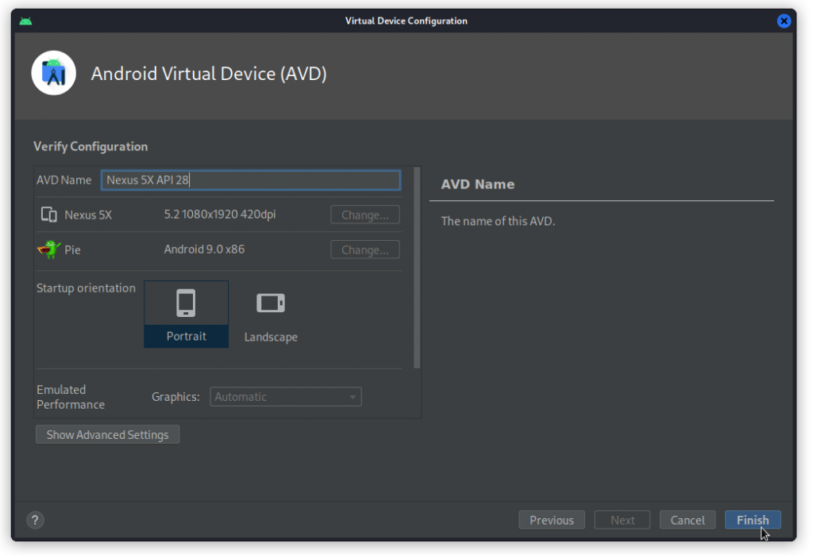
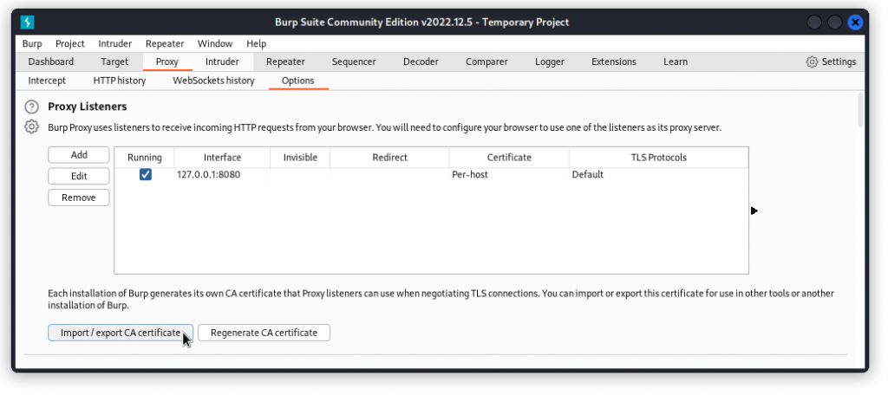

# Introduction
Mobile apps are great targets for anyone interested in hacking APIs. Mobile apps will often connect to a supporting web application through an API.

By intercepting and reviewing the traffic with a tool like Burp Suite, you can get a pretty good understanding of how the API works and, if you’re lucky, spot some vulnerabilities.

So how does that work? Well, you need an Android emulator on your PC, whose traffic you can proxy through Burp Suite (hacking IOS apps requires a different workflow altogether that I won’t go into here).

On the emulator, you can either install your target apps directly using the Google Play Store, or use apps that you will have extracted as an APK file from an existing Android phone using APK Extractor.

# Install Android Studio

There are a number of Android emulators around, such as Genymotion or Anbox. However, the one that worked best for me is Android Studio. 
It’s actually a full development environment for Android apps, that includes an Android emulator. This is how you install it on a Linux system:
Get the app from the [Android Studio](https://developer.android.com/studio/index.html#downloads) download page and save it to your home directory. 

You will get a file called android-studio-2022.1.1.20-linux.tar.gz (note that the version number will likely have changed by the time you read this article).

Unpack it with:
```bash
$ sudo tar -xvzf android-studio-2022.1.1.20-linux.tar.gz
```
```bash
$ cd android-studio/bin
$ ./studio.sh
```
This completes the download and installs the full Android Studio application. 
A standard install takes up 6 Gb, but after creating a device, the install will take up 12 Gb. 
So make sure you have enough disk space.

# Create and launch a virtual device
In Android Studio’s main window, click on the three vertical dots at the top right and select Virtual Device Manager.


Then, click on Create Device, at the top left of the window.

Now select a Nexus 5X then click Next.


Next, click on Pie. This will download the system image.


With Pie selected in the list, you can now click on Next.


Check the configuration and give your device a personalized name if you want to. Then click Finish.



To start the emulator, select the device in the list and click the start (triangle) button.


#### Your device starts up and appears in it own window.


Now you need to make sure your wifi access is functional.

Click on the surface of the device and move your mouse or pointer upwards. Then click on the Settings icon at the top right of the display.


Select Network & Internet.

Then click on Wi-Fi. Make sure Use Wi-Fi is on and AndroidWifi is indicated as Connected.


If the connection is down, you may want to check your proxy settings. To do this, click on the three dots at the bottom of the side bar.

In the box that shows up, select the Settings panel, then in the Proxy section, make sure No proxy is selected. 
Click Apply if required. Then close the box. You should be good to go.


# Set your virtual device’s CA certificate

Now you need to install a CA certificate (as a reminder, this is digital certificate that your virtual device’s web browser will need to access web sites using https).

Start Burp Suite, select the Proxy tab and the Options sub-tab.

Click the Import / export CA certificate button.



Under Export, choose Certificate in DER format and click the Next button.


Save the file and name it cert.cer. Now you can exit Burp Suite.


Open the file manager and drag the cert file onto the Android emulator device window.


In the Android emulator device window, go to the Settings app. Then scroll down to the Security & location panel


Go to the Encryption & credentials section. Then click Install from SD Card.


From the burger menu at the top left, select Downloads. Then choose cert.cer.


Name the certificate Burp then click OK.

When you get the message "Attention. Before you can use credential storage, your device needs to have a secure lock screen", click SET LOCK.


Then select Continue without fingerprint then PIN. In the Secure start-up screen that comes up, click NO.

In the following Set screen lock screen, type in a PIN code then click NEXT. Then re-enter your PIN and click CONFIRM.


In Notifications, select Don’t show notifications at all then click DONE.


You’re back in the Encryption & credentials panel. Now to check the certificate is properly set, click on User credentials. 
You should see the Burp credential as the only item in the list.


# Configure your device’s proxy settings

Still in the Android emulator device window, click on the three dots at the bottom of the side bar.

In the box that comes up, go to the Settings panel. Then in the proxy section, make sure Use Android Studio HTTP proxy settings is unchecked. Then select Manual proxy configuration. In the Host name field, type `127.0.0.1` and in the Port number field, enter `8080`. Then click Apply. Then close the window.


# Start hacking

To check your settings, start Burp Suite, then go to the Proxy tab and the Intercept sub-tab. Turn Intercept on. 
Then in the Android emulator device window, start an app and interact with it.

In the below example, I’m using The Comment App from the vAPI vulnerable training API. I’m creating a new user. 
The app sends a POST request that is intercepted by Burp and displayed in the Intercept screen.


