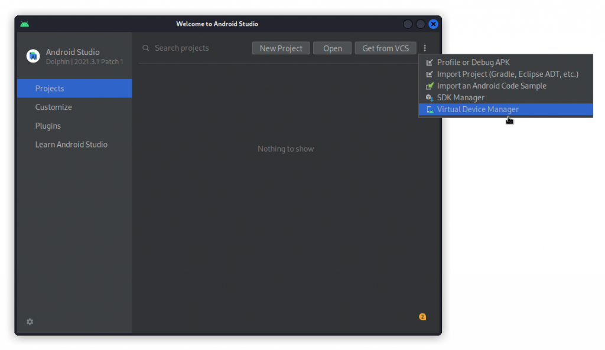

# Introduction
Mobile apps are great targets for anyone interested in hacking APIs. Mobile apps will often connect to a supporting web application through an API.

By intercepting and reviewing the traffic with a tool like Burp Suite, you can get a pretty good understanding of how the API works and, if you’re lucky, spot some vulnerabilities.

So how does that work? Well, you need an Android emulator on your PC, whose traffic you can proxy through Burp Suite (hacking IOS apps requires a different workflow altogether that I won’t go into here).

On the emulator, you can either install your target apps directly using the Google Play Store, or use apps that you will have extracted as an APK file from an existing Android phone using APK Extractor.

# Install Android Studio

There are a number of Android emulators around, such as Genymotion or Anbox. However, the one that worked best for me is Android Studio. 
It’s actually a full development environment for Android apps, that includes an Android emulator. This is how you install it on a Linux system:
Get the app from the [Android Studio](https://developer.android.com/studio/index.html#downloads) download page and save it to your home directory. 

You will get a file called android-studio-2022.1.1.20-linux.tar.gz (note that the version number will likely have changed by the time you read this article).

Unpack it with:
```bash
sudo tar -xvzf android-studio-2022.1.1.20-linux.tar.gz
```
```bash
cd into android-studio/bin then run:
./studio.sh
```
This completes the download and installs the full Android Studio application. 
A standard install takes up 6 Gb, but after creating a device, the install will take up 12 Gb. 
So make sure you have enough disk space.

# Create and launch a virtual device
In Android Studio’s main window, click on the three vertical dots at the top right and select Virtual Device Manager.



Then, click on Create Device, at the top left of the window.

Now select a Nexus 5X then click Next.


